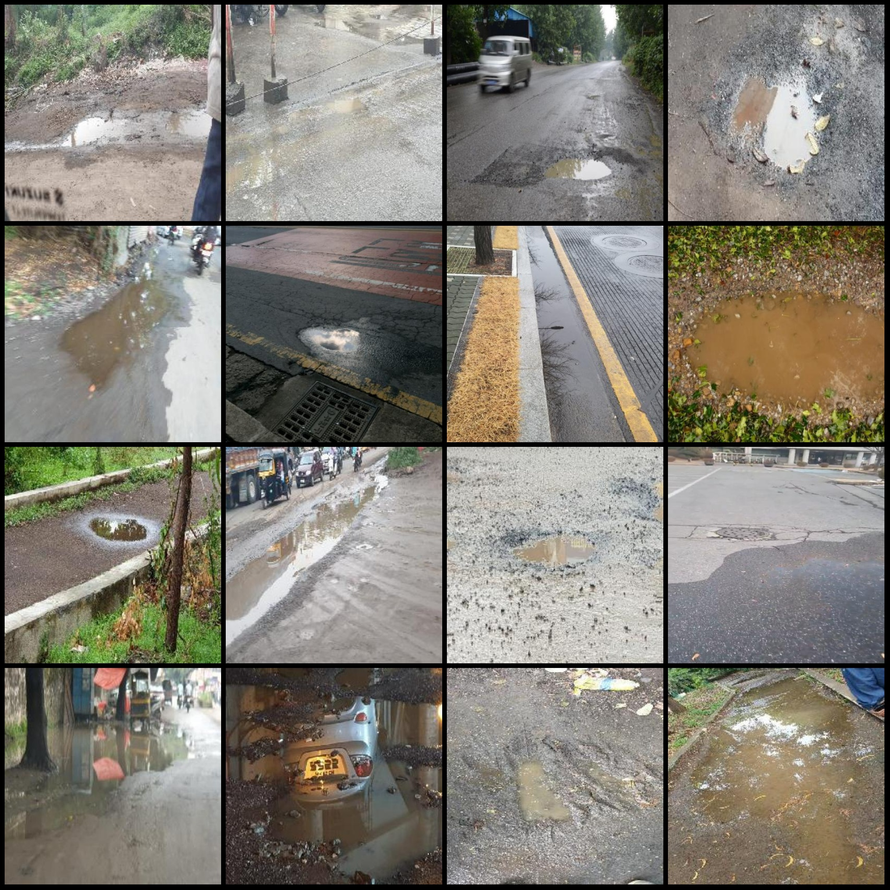
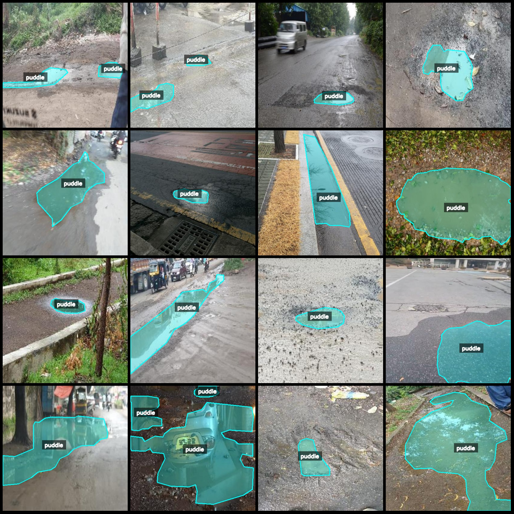
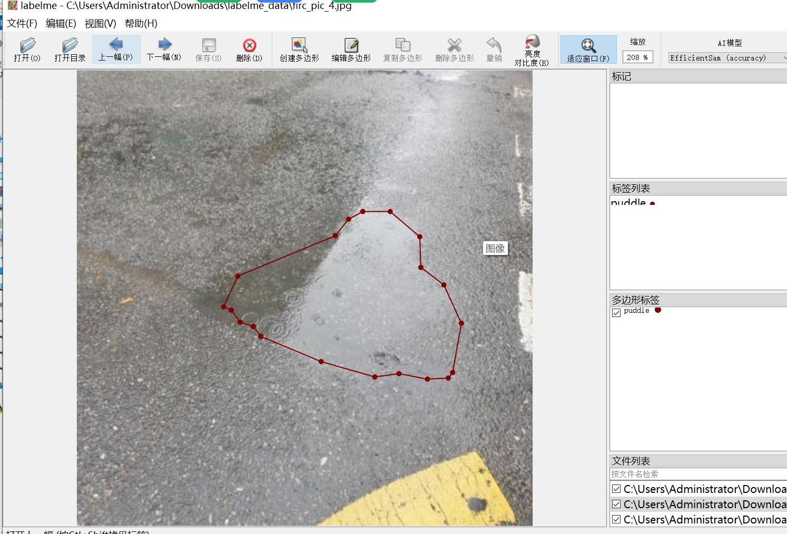

# Intelligent Traffic City Road Puddle Identification and Segmentation Dataset in LabelMe Format

## Dataset Format: LabelMe Format (excluding mask files, only containing JPG images and corresponding JSON files)

### Image Count: 1489 Images

- Number of Images (JPG file count): 1489
- Number of Annotations (JSON file count): 1489
- Number of Annotation Categories: 1
- Annotation Category Name: ["puddle"]

Each category has a number of bounding boxes:
- puddle count = 2347
- Total bounding boxes: 2347

Using the annotation tool: labelme version 5.5.0

Image resolution: 416x416

Annotation rules: Polygons are drawn around the categories.

Important Notes: The dataset can be opened and edited using the labelme format. The JSON dataset needs to be converted into either mask or YOLOF/COCO format for semantic segmentation or instance 
segmentation.

Special Disclaimer: This dataset does not guarantee the accuracy of the trained models or weight files.

Image Preview:

Annotation Examples:

Randomly selected 16 images for illustration:

Annotation drawing results:

Labelme editing image example:

## Images

Here is a pay link on Stripe ( https://buy.stripe.com/3cs8yP7sY87d0vu9AB ). Please contact me lonlonago@foxmail.com after funding $89, and I will send you a complete data files , thank you!

